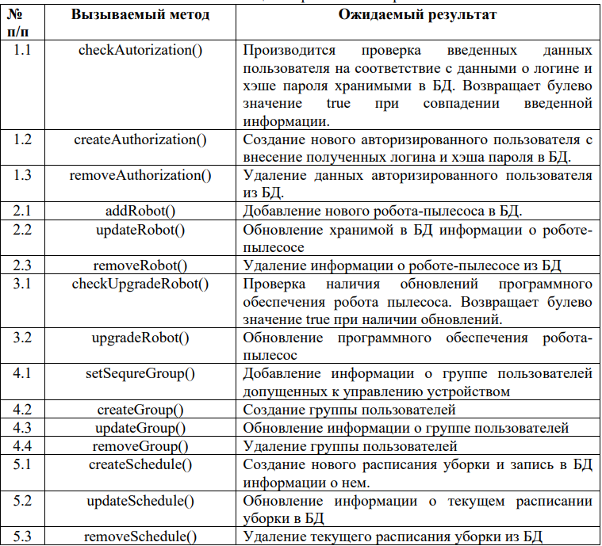
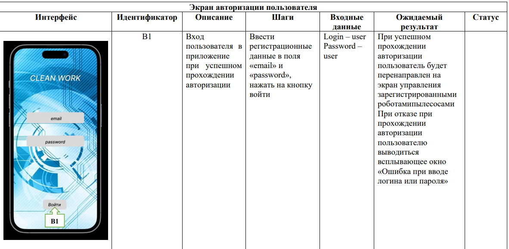
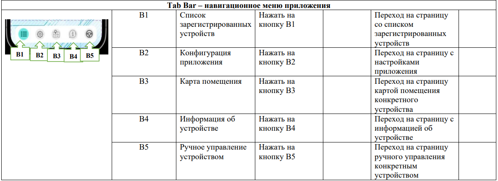
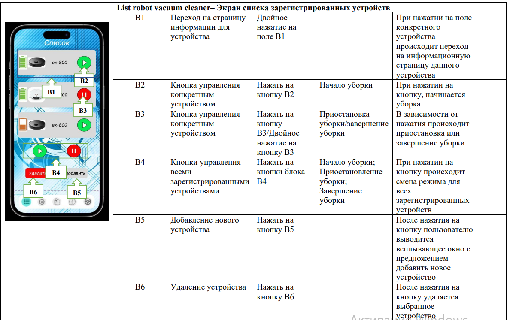
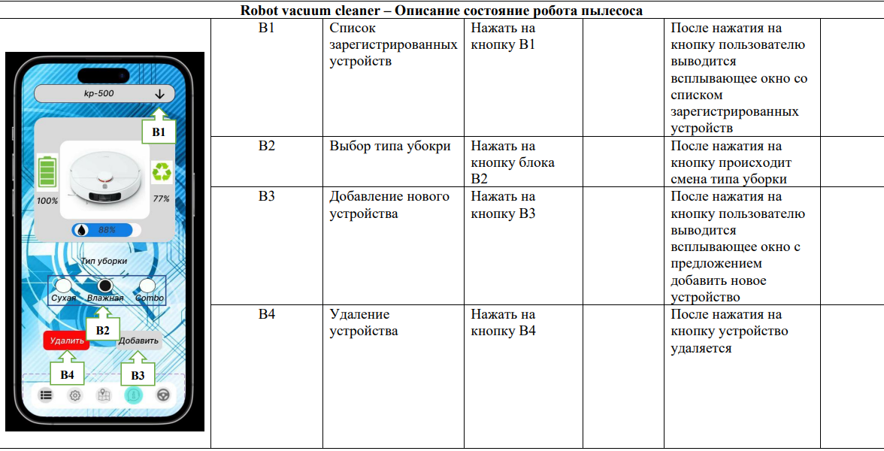
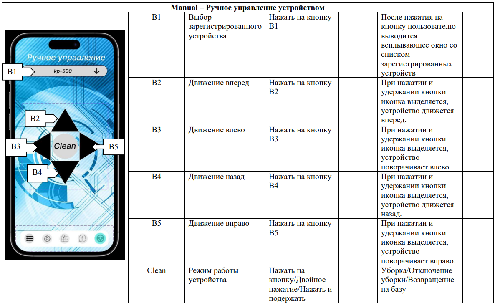

# SEMINAR_12
Урок 12. Принципы тестирования приложений

План тестирования облачного сервиса и приложения по
управлению роботом-пылесосом
1. Unit – тесты: Пишутся по мере написания кода на классы и методы API облачного
сервиса, API обновления, авторизации и мобильного приложения.
2. E2E-тестирование: Проводим после завершения работы над кодом. Тестируем
каждую систему на работоспособность. При этом воздействуем на систему через ее
самые внешние интерфейсы и проверяем ожидаемую реакцию системы через эти
же интерфейсы.
Таблица 1. Протокол тестирования API облачной системы

3. UAT – тестирование: готовый программный продукт тестирует ограниченный
круг пользователей. Тестируется каждый case из UseCase диаграммы. При этом
группа людей изучает эффективность сервиса, его функционала. UAT нужен для
того, чтобы понять: а) как ведет себя продукт в реальных условиях, соответствует
ли результат задумке; б) выявить, были ли добавлены все возможные функции; в)
проверить, есть ли ошибки, которые будут мешать пользователю.

Таблица 2. UAT – тестирование приложения робота-пылесоса

